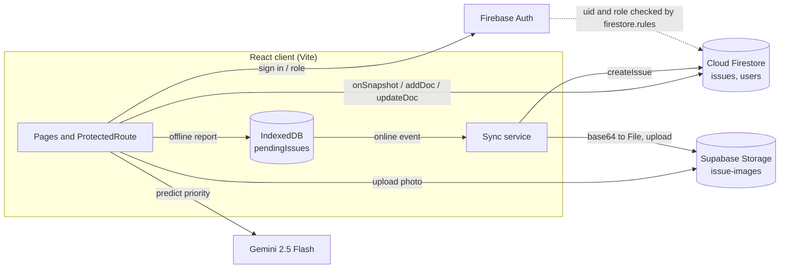

# Jansewa

Offline-first civic issue reporting with role-based tracking for citizens, field engineers and supervisors.

[](https://github.com/saumya-st/JANSEWA-PROJECT/actions/workflows/ci.yml)
[](LICENSE)
[](package.json)

## What it is

Reporting a broken street light or an open drain usually means a phone call that goes nowhere, and the person who reported it never learns what happened next. Jansewa is a web app where citizens file geo-tagged, photographed reports (even without a connection), supervisors assign them to engineers from a live map, and everyone watches the same status timeline update in real time.

## Live demo

<!-- TODO: add deployed URL -->
A hosted demo is not available yet. See [Getting started](#getting-started) to run it locally.

## Screenshots

| | |
|---|---|
| **Landing page** | **Login** (Google or email/password) |
|  |  |
| **Dashboard** with status counts | **Report issue** with photo, GPS location and AI priority |
|  |  |
| **My issues** (citizen) with status filter | **Assigned issues** (engineer) |
|  |  |
| **Map view** (supervisor) with assignment | **Issue details** with timeline |
|  |  |

## Key features

- **Offline-first reporting queue.** When the browser is offline, a report (including its photo as a base64 data URL) is written to an IndexedDB store. A sync service listens for the `online` event, converts the image back to a `File`, uploads it, and creates the Firestore document.
- **Role-based routing.** Three roles (`citizen`, `engineer`, `supervisor`) read from `users/{uid}.role`. Each role has its own landing page and route allow-list; unauthorised routes redirect.
- **Real-time status.** Issue lists and the details page subscribe with Firestore `onSnapshot`, so a status change by an engineer appears on the citizen's screen without a reload.
- **Gemini priority prediction.** One click sends the title and description to `gemini-2.5-flash` and fills in Low / Medium / High / Critical. The citizen can still override it.
- **Supabase image storage.** Issue photos and completion photos go to a public Supabase Storage bucket, organised by user id.
- **Leaflet map view.** Supervisors see every issue as a colour-coded marker, open its popup and assign an engineer in place.
- **Status timeline.** Every report, assignment and status change appends a timestamped event that is rendered on the details page.
- Also: geolocation capture with reverse geocoding (OpenStreetMap Nominatim), dark mode, Google and email/password sign-in.

## Tech stack

| Layer | Choice |
|---|---|
| UI | React 18, Vite 6, Tailwind CSS 4, lucide-react icons, sonner toasts, next-themes |
| Routing | react-router 7 with a client-side `ProtectedRoute` |
| Auth | Firebase Authentication (Google popup, email/password) |
| Database | Cloud Firestore (`issues`, `users` collections) with `onSnapshot` listeners |
| Offline queue | IndexedDB via `idb` |
| Image storage | Supabase Storage bucket `issue-images` |
| Maps | Leaflet + react-leaflet, OpenStreetMap tiles and Nominatim reverse geocoding |
| AI | `@google/generative-ai` (`gemini-2.5-flash`), called from the browser |
| Quality | ESLint 9 (flat config), Vitest 3, GitHub Actions |

## Architecture


```mermaid
flowchart LR
    subgraph Browser["React client (Vite)"]
        UI[Pages and ProtectedRoute]
        Q[(IndexedDB<br/>pendingIssues)]
        S[Sync service]
    end

    UI -- sign in / role --> FA[Firebase Auth]
    UI -- onSnapshot / addDoc / updateDoc --> FS[(Cloud Firestore<br/>issues, users)]
    UI -- upload photo --> SB[(Supabase Storage<br/>issue-images)]
    UI -- predict priority --> GM[Gemini 2.5 Flash]

    UI -- offline report --> Q
    Q -- online event --> S
    S -- base64 to File, upload --> SB
    S -- createIssue --> FS

    FA -. "uid and role checked by firestore.rules" .-> FS
```

Firestore is the single source of truth. The IndexedDB store is only a write-ahead queue for reports made while offline; nothing is read from it except by the sync service.

## Getting started

### 1. Firebase

1. Create a project at [console.firebase.google.com](https://console.firebase.google.com).
2. **Authentication**: enable the *Google* and *Email/Password* sign-in providers.
3. **Firestore Database**: create a database (production mode is fine; rules come next).
4. **Project settings -> General -> Your apps**: add a Web app and copy the `firebaseConfig` values into `.env`.
5. Deploy the security rules in this repo:

   ```bash
   npm install -g firebase-tools
   firebase login
   firebase use <your-project-id>
   firebase deploy --only firestore:rules
   ```

   `firebase.json` points at `firestore.rules`. The rules enforce the role model server-side: signed-in users can read issues, citizens can only create issues under their own uid, engineers can only update progress fields on issues assigned to them, supervisors can assign, and nobody can change their own role. New accounts are created as `citizen`; promote a user to `engineer` or `supervisor` by editing `users/{uid}.role` in the Firebase console.

   The rules have not been run against the Firestore emulator in this repo. To test them locally: `firebase emulators:start --only firestore`.

### 2. Supabase (images)

1. Create a project at [supabase.com](https://supabase.com) and copy the *Project URL* and *anon public* key into `.env`.
2. **Storage**: create a bucket named `issue-images` and mark it **Public** (the app renders images by public URL).
3. Add policies on `storage.objects` for that bucket. The app uploads to `<uid>/<timestamp>-<filename>`, so the intended policy pair is public read plus authenticated insert into the caller's own uid folder:

   ```sql
   -- Anyone can view issue images.
   create policy "issue-images public read"
   on storage.objects for select
   using (bucket_id = 'issue-images');

   -- Signed-in users may upload only into a folder named after their uid.
   create policy "issue-images authenticated insert"
   on storage.objects for insert to authenticated
   with check (
     bucket_id = 'issue-images'
     and (storage.foldername(name))[1] = auth.uid()::text
   );
   ```

   **Known limitation.** The app signs in with Firebase, not Supabase Auth, so today its requests reach Supabase as the `anon` role and the insert policy above will reject them. Until Firebase ID tokens are exchanged for a Supabase session (see [Future work](#future-work)), use this interim policy instead, understanding that anyone holding the anon key can then upload to the bucket:

   ```sql
   create policy "issue-images anon insert (interim)"
   on storage.objects for insert to anon
   with check (bucket_id = 'issue-images');
   ```

### 3. Gemini

Create an API key in [Google AI Studio](https://aistudio.google.com/app/apikey). Because the key is bundled into the browser build, **restrict it by HTTP referrer** to your dev and production origins and set a usage quota.

### 4. Run

```bash
git clone https://github.com/saumya-st/JANSEWA-PROJECT.git
cd JANSEWA-PROJECT
cp .env.example .env     # fill in the values from the steps above
npm install
npm run dev              # http://localhost:5173
```

Requires Node 20 or newer.

## Scripts

| Command | What it does |
|---|---|
| `npm run dev` | Vite dev server with HMR |
| `npm run build` | Production build to `dist/` |
| `npm run preview` | Serve the production build locally |
| `npm run lint` | ESLint over the whole repo |
| `npm test` | Vitest, single run |

## Testing and CI

Unit tests live next to the code they cover in `src/utils/*.test.js`:

- `roleRoutes.test.js`: route allow-lists per role and default landing routes.
- `indexedDB.test.js`: the offline queue (add, read, mark synced, clear synced, pending count) against `fake-indexeddb`.
- `syncService.test.js`: `isBase64Image` and `base64ToFile`, with the Firestore and Supabase modules mocked.

`.github/workflows/ci.yml` runs `npm ci`, lint, tests and a production build on Node 20 for every push to `main` and every pull request. The build needs no secrets because `VITE_*` values fall back to empty strings.

## Docker

A multi-stage `Dockerfile` builds the bundle on `node:20-alpine` and serves `dist/` from `nginx:alpine` with an SPA fallback (`nginx.conf`). Vite inlines environment variables at build time, so pass them as build args:

```bash
docker build -t jansewa \
  $(grep -v '^#' .env | grep . | sed 's/^/--build-arg /') .
docker run --rm -p 8080:80 jansewa
```

The Docker setup has not been verified locally (Docker was not installed on the authoring machine).

## Design decisions and trade-offs

**Why IndexedDB, Firestore and Supabase together.** An offline write queue needs a durable local store that survives tab closes, which IndexedDB provides and `localStorage` cannot do safely for images. Firestore gives auth-integrated, real-time document sync with security rules, so it holds all issue data. Firebase Storage was not used for photos; Supabase Storage holds them instead, and only the public URL is stored in Firestore. The cost is three SDKs in the bundle and two consoles to configure.

**Base64 fallback for offline photos.** A photo attached offline is stored as a data URL in IndexedDB and converted back to a `File` at sync time. If that upload fails, the sync service emits an `image_upload_failed` event and still creates the issue with the base64 string so the report is not lost. The trade-off is a much larger Firestore document (and a failed write if it exceeds the 1 MiB document limit); re-uploading such images later is listed under future work.

**Client-side Gemini call.** Calling Gemini from the browser avoided a backend for a single prompt, but it exposes the API key in the bundle. The mitigation is referrer restriction and quotas; the proper fix is a Cloud Function (see below). The feature is optional and the citizen can always set priority manually.

**Client-side role routing is UX only.** `ProtectedRoute` and `roleRoutes.js` decide what a user *sees*. What a user can *do* is enforced by `firestore.rules`, which re-derives the role from `users/{uid}` on every write. Anyone bypassing the UI still hits the rules.

**A custom queue instead of Firestore's built-in offline persistence.** Firestore can buffer writes offline on its own, but the app needs to run the Supabase image upload *before* the document is created and to show a "pending sync" count on the report form. A small explicit queue in IndexedDB makes that ordering and that UI state straightforward.

## Future work

- Move the Gemini call behind a Firebase Cloud Function so the key never ships to the browser.
- Exchange Firebase ID tokens for a Supabase session so Storage uploads can be restricted to authenticated users.
- PWA service worker for a true offline shell (today only the write queue is offline-capable).
- Push notifications when an issue is assigned or its status changes.
- Pagination or `startAfter` cursors on issue lists (currently capped at the 250 most recent).
- Re-upload base64 images that fell back into Firestore when the sync-time upload failed.
- Admin dashboard for role management instead of editing `users/{uid}.role` in the console.

## License

[MIT](LICENSE)

## Author

Saumya Tiwari: [GitHub](https://github.com/saumya-st) | [Portfolio](https://saumya-tiwari.vercel.app) | [LinkedIn](https://www.linkedin.com/in/saumya-tiwari-22909a330)
